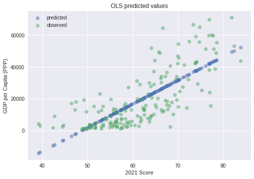
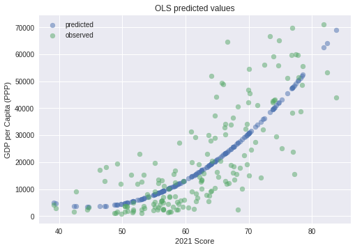
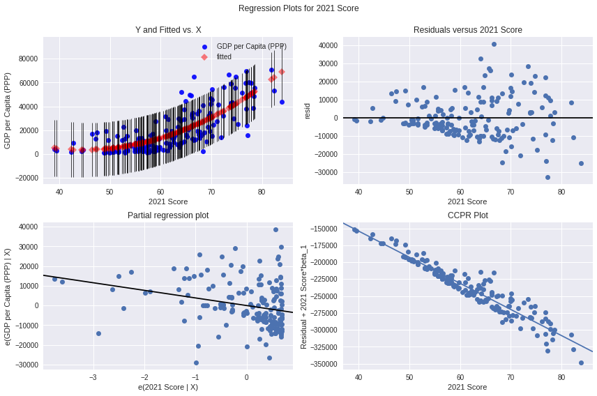

# Regression based on the Economic Freedom index

## Is there a relationship between the level of economic freedom in a country and its GDP per capita?

To answer this question, we will use different regressions that will take GDP per capita with purchasing power parity as the dependent variable (that is, the one we want to explain) and the economic freedom score of the Heritage Foundation as the independent or explanatory variable.

All data was extracted from: https://www.heritage.org/index/excel/2021/index2021_data.xls

For this analysis we will use Python and the modules numpy, Pandas, statsmodel and matplotlib. The code and its step-by-step execution can be found in the jupyter notebooks in the repo.

First, we use pandas to import the data and convert it into a pandas dataframe. Then we clean it from those countries for which we do not have enough information. If we open the variable in which we save these countries, we see that there are 6 eliminated: Iraq, Libya, Liechtenstein, Somalia, Syria and Yemen.

After this, we're going to create a scatterplot to see if we can see a simple view of a relationship in the data.

We can clearly see that a measure that increases the economic freedom score increases GDP per capita. Also, we have several outliers that can have an outsized influence on our regression result, marked as blue dots. These points will be eliminated so that they do not affect our results.

The limits were chosen with the following criteria:

Upper Limit = Q3 + 1.5*IQR

Lower Limit = Q1 – 1.5*RIQ

Fraud:

Q1 = Quartile 1, point containing 25% of the values
Q3 = Quartile 3, point containing 75% of the values
IQR = Interquartile range, result of subtracting Q3 from Q1

After all this, let's start with a simple linear regression.

We assign the values ​​of GDP per capita to the 'y' variable to be explained and the economic freedom score to the explanatory 'x' variable. We use the statsmodels module to run the regression and plot the results as well as the residuals:

Regression Results:

| Concepts | Detail |
| -------------------- |:------------------:|
| Dependent Variable |GDP per Capita (PPP)|
| No. of Observations | 171 |
| R² | 0.565 |
| R² adjusted | 0.562
| Prob (F-statistic) | 2.38e-32 |

We can see that our R² is reasonable and the connection is statistically significant. However, analyzing the residuals in more detail, it can be seen that they have a non-linear relationship. This means that a regression with another form could fit our data better.

We then try a quadratic regression, adding one more term to the quantity, which will be the economic freedom scores squared.

We run the regression and we have:

Regression Results:

| Concepts | detail
|--------------|------------
| R² | 0.626
| R² adjusted | 0.621
| Durbin-Watson | 2,172
| Prob (F-statistic) | 1.42e-36

We now have an even higher R², at 0.817, and more importantly, the adjusted R² is slightly lower, at 0.815, which means that the variable we added actually increases the explanatory power of our model.

In the analysis of the residuals, what we can see is that our non-linearity problem probably disappeared, having much more uniform residuals. However, as economic freedom scores increase, the residuals become more spread out and erratic. This means that we have a heteroscedasticity problem, that is, that at the upper end, our model is not as accurate as at the lower or median values. We can verify this by reading the Durbin-Watson value, which, being greater than 2, shows some heteroscedasticity (between 1 and 2 being the ideal homoscedasticity values).

Our final model would be: y = 42.9777x² - 3854.5294x + 8.99e+04

Conclusion: We can state that there is a statistically significant relationship between GDP per capita by purchasing power parity and the Heritage Foundation's economic freedom score. The explanation of the proposed heteroscedasticity is that a relatively free economy is a necessary condition for economic development, but the time that measures have been applied greatly influence the current state of GDP per Capita. To give an example, Estonia has high economic freedom but is a relatively poor country compared to Japan which is lower in the economic freedom ranking. However, the liberal reforms in Estonia were taken in the 1990s, while Japan has been since the end of the 2nd
