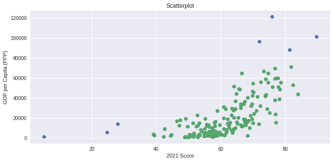

# Regresión basada en el indice de Libertad Económica

## ¿Existe una relación entre el nivel de libertad económica en un país y su PBI per capita?

Para responder esta pregunta, utilizaremos diferentes regresiones que tomarán como variable dependiente (es decir, la que queremos explicar) al PBI per capita con paridad del poder adquisitivo y como variable independiente o explicativa al punteje de libertad económica de la fundación Heritage.

Todos los datos fueron extraídos de: https://www.heritage.org/index/excel/2021/index2021_data.xls

Para este analisis utilizaremos Python y los modulos numpy, Pandas, statsmodel y matplotlib.

En primer lugar, utilizamos pandas para importar los datos y convertirlos en un dataframe de pandas. Luego la limpiamos de aquellos países de los que no contamos con la información suficiente. Si abrimos la variable en la que guardamos estos países, vemos que los eliminados son 6: Irak, Libya, Liechtenstein, Somalia, Syria y Yemen.

Después de esto, vamos a crear un scatterplot para ver si podemos ver a simple vista una relación en los datos.

Podemos ver claramente que a medida que aumenta el puntaje de libertad económica, aumenta el PBI per capita. Ademas, tenemos varios outliers que pueden tener una influencia desmesurada en el resultado de nuestra regresión, marcados como puntos azules. Estos puntos serán eliminados para que no incidan en nuestros resultados

Los limites fueron elegidos con el siguiente criterio:

Limite Superior = Q3 + 1,5*IQR

Limite Inferior = Q1 – 1,5*IQR

Con:

Q1 = Cuartil 1, punto que contiene el 25% de los valores
Q3 = Cuartil 3, punto que contiene el 75% de los valores
IQR = Rango intercuartil, resultado de restar Q3 a Q1

Luego de todo esto, comencemos con una regresión lineal simple.

Asignamos los valores de PBI per capita a la variable ‘y’ a explicar y el puntaje de  libertad económica a la variable ‘x’ explicativa. Utilizamos el modulo statsmodels para realizar la regresión y ploteamos los resultados asi como también los residuos:

Resultados de la Regresión:

|    Conceptos         |      Detalle       | 
| -------------------- |:------------------:|
|  Variable Dependiente  |PBI per Cápita (PPP)|
|  Nº de Observaciones   |         171        |
|  R²                    |        0.638       |
|  Prob (F-statistic)   |    2.31e-39        |

Podemos ver que nuestro R² es razonable y la correlación es estadisticamente significativa. Sin embargo, analizando mas detalladamente los residuos, se aprecia que estos tienen una relación no lineal. Esto quiere decir, que una regresión con otra forma podría ajustarse mejor a nuestros datos.

Probamos entonces con una regresión cuadratica, añadiendo un termino mas a la ecuación, que serán los puntajes de libertad económica elevados al cuadrado.

Corremos la regresión y tenemos:

Resultados de la Regresión:

|   Conceptos   |    Detalle
|--------------|------------
|   R²   |    0,817   
|   R² ajustado   | 0,815
|   Durbin-Watson   |   2,131
|   Prob (F-statistic)   | 4.08e-63

Tenemos ahora un R² todavía mas alto, de 0,817 y lo que es mas importante, el R² ajustado es apenas menor, de 0,815, lo que quiere decir que la variable que agregamos realmente aumenta el poder explicativo de nuestro modelo.

En el analisis de los residuos, lo que podemos ver es que nuestro problema de no-linealidad obviamente desapareció, teniendo residuos bastante mas uniformes. Sin embargo, a medida que los puntajes de libertad económica aumentan, los residuos se hacen mas dispersos y erraticos. Esto quiere decir que tenemos un problema de heterocedasticidad, es decir, que en el extremo superior, nuestro modelo no es tan preciso como en los valores mas medianos o inferiores. Podemos comprobarlo al leer el valor de Durbin-Watson, que al ser mayor a 2 muestra cierta heterocedasticidad (siendo entre 1 y 2 los valores ideales de homocedasticidad)

Nuestro modelo final sería: y = 20,0134x² - 950,0644x

Conclusión: Podemos afirmar que existe una relación estadisticamente significativa entre el PBI per capita por paridad de poder adquisitivo y el puntaje de libertad económica de la fundación Heritage. La explicación de la heterocedasticidad propuesta es que una economía relativamente libre es condición necesaria para el desarrollo económico, pero el tiempo que llevan siendo aplicadas estas medidas influyen de gran manera en el estado actual del PBI per Capita. Para poner un ejemplo, Estonia tiene una alta libertad económica pero es un país relativamente pobre comparado con Japón que está mas abajo en el ranking de libertad económica. Sin embargo, las reformas liberales en Estonia se tomaron en los 90s, mientras que Japón lleva desde el fin de la 2da Guerra Mundial con una economía relativamente libre.

